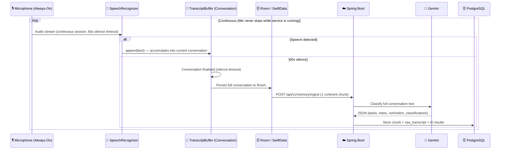

# 🔄 Data Pipeline

The Edrak data pipeline is a 6-step process that transforms raw microphone audio into structured, searchable knowledge with dynamic AI-driven classifications.

## Pipeline Flow

## Step-by-Step Breakdown

### Step 1: Continuous Listening

- **Input:** Raw microphone stream via `SpeechRecognizer` (Android) / `AVAudioEngine` (iOS)
- **Mic Lifecycle:** The microphone is **always on** while the foreground service is running. It is **only closed** when the user manually stops or pauses the service (from app or notification).
- **Android Engine:** `SpeechRecognizer` in seamless loop — handles mic capture, speech detection, cloud transcription, and silence detection in one API
- **iOS Engine:** `AVAudioEngine` with `installTap` → Energy-based VAD → STT
- **Android Optimizations:**
  - `RecognitionListener` created once, reused across all cycles
  - `cancel()` + `startListening()` for instant restart (~10ms gap)
  - 60-second silence timeout keeps cycles alive longer
  - `PipelineState` stays as `LISTENING` between cycles — never flickers

### Step 2: Conversation-Based Accumulation

- **Architecture:** Speech results are **NOT** sent individually. Instead, `TranscriptBuffer` accumulates all speech into an ongoing **conversation** (StringBuilder).
- **Finalization Triggers:**
  - **60 seconds of silence** → conversation is complete → finalize and queue for sync
  - **500 words reached** → auto-finalize to prevent huge chunks
  - **Service stops** → `flushAll()` force-finalizes any ongoing conversation
- **Result:** A 30-minute meeting becomes **1 coherent transcript**, not 500 fragments
- **Privacy:** Audio is never stored to disk — only transcribed text is persisted

### Step 3: Smart Sync (Conversation-Aware)

- **Sync Loop:** `EdrakListeningService` checks every 10 seconds:
  1. `checkAndFinalizeIfSilent()` — finalize conversation if 60s silence elapsed
  2. `syncIfNeeded()` — persist finalized conversations to Room, then send to API
- **Crash Safety:** Conversations are persisted to Room before any network call. If the app is killed, `SyncEngine.syncOrphanedEntries()` recovers them on next start.
- **Offline Resilience:** Failed syncs stay in `pending_transcripts` for WorkManager retry

### Step 4: Connectivity-Aware Batch Sync

The app uploads finalized conversations to the backend only when **all** conditions are met:

| Condition | Description |
|-----------|-------------|
| **Network available** | `ConnectivityManager` confirms connectivity |
| **Conversation finalized** | 60s silence or 500 words or service stop |
| **No backoff active** | `consecutiveFailures < 5` |

### Step 5: Raw Transcript Persistence (Server)

Each conversation chunk is saved as **one** `raw_transcript` record (not per-word), so users can query their transcripts by date.

### Step 6: Dynamic AI Classification

The backend receives the full conversation text and processes it asynchronously:

1. **Store raw text** in `memory_chunks` table
2. **Save conversation** as single `raw_transcript` record (queryable)
3. **Generate embedding** using Gemini Embedding API → store as `vector(768)`
4. **Classify with dynamic categories:** Gemini analyzes full conversation context
5. **Create/link classifications** in `user_classifications` table
6. **Parse items** (tasks, notes, reminders) with full conversational context
7. **Respond** with `202 Accepted` (async)

## Data Destruction Policy

| Data | Where | Lifetime |
|------|-------|----------|
| Raw audio | Device RAM only | Never stored — SpeechRecognizer manages internally |
| Audio files | Never created | N/A — audio stays in RAM buffers |
| Ongoing conversation | Device RAM (TranscriptBuffer) | Finalized on silence/stop → moved to Room |
| Finalized conversations | Room/SwiftData (device) | Deleted after successful sync |
| Transcribed text | Server (PostgreSQL) | Retained in user's account |
| AI classifications | Server (PostgreSQL) | Per-user, evolves with usage |

## Platform Implementation

| Component | Android | iOS |
|-----------|---------|-----|
| Audio capture | `SpeechRecognizer` (continuous loop) | `AVAudioEngine` + `installTap` |
| Speech detection | `SpeechRecognizer` (built-in) | `EnergyVADService` (Accelerate vDSP) |
| STT | `SpeechRecognizer` (Google on-device/cloud) | `MockSTTService` (Phase A) |
| Buffer | `TranscriptBuffer` (conversation accumulation) | `TranscriptBuffer` (actor) |
| Persistence | Room (`PendingTranscriptEntity`) | SwiftData (`PendingTranscript` @Model) |
| Sync | `SyncEngine` (Mutex + Retrofit) | `SyncEngine` (@ModelActor + URLSession) |
| Connectivity | `ConnectivityManager` | `NWPathMonitor` |
| CPU keep-alive | `PARTIAL_WAKE_LOCK` | Background audio mode |
| Service state | `ListeningStateHolder` (StateFlow) | `ListeningService` (@Observable) |
