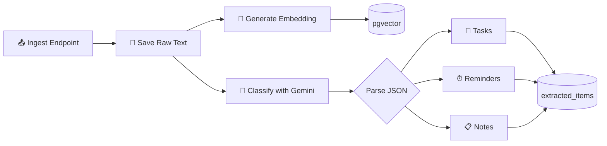

# 🤖 AI Pipeline

The AI pipeline processes raw transcribed text through Google Gemini 1.5 Flash for classification, extraction, and embedding generation.

## Pipeline Architecture



## Async Processing Flow

The ingestion endpoint is **asynchronous** — it returns `202 Accepted` immediately while AI processing happens in a background thread.

```java
@PostMapping("/ingest")
public ResponseEntity<ApiResponse<IngestResponse>> ingest(
        @Valid @RequestBody IngestRequest request,
        @AuthenticationPrincipal UserEntity user) {
    // 1. Save raw text synchronously (fast)
    MemoryChunkEntity chunk = memoryService.saveRawText(user.getId(), request);
    
    // 2. Trigger async AI processing (background)
    memoryService.processChunkAsync(chunk.getId());
    
    // 3. Return immediately
    return ResponseEntity.status(HttpStatus.ACCEPTED)
            .body(ApiResponse.success("Processing in background", ...));
}
```

## Gemini API Integration

### Client Configuration

```java
@Configuration
public class GeminiConfig {
    
    @Value("${app.gemini.api-key}")
    private String apiKey;
    
    @Bean
    public RestClient geminiRestClient() {
        return RestClient.builder()
                .baseUrl("https://generativelanguage.googleapis.com/v1beta")
                .defaultHeader("x-goog-api-key", apiKey)
                .build();
    }
}
```

### Classification Request

The service sends the raw text with a structured system prompt and expects a JSON response:

1. Text → Gemini 1.5 Flash → Structured JSON
2. Parse JSON into `ClassificationResult` POJO
3. Map to `ExtractedItemEntity` records
4. Save to database

### Embedding Generation

For the RAG pipeline, each memory chunk gets a vector embedding:

1. Text → Gemini Embedding API (`text-embedding-004`) → `float[768]`
2. Store as `vector(768)` in `memory_chunks.embedding` column
3. Used later by the Chat/RAG feature for similarity search

## Error Handling

| Error | Strategy |
|-------|----------|
| Gemini API timeout | Retry 3 times with exponential backoff |
| Invalid JSON response | Log warning, mark chunk as `processed = true` with no items |
| Rate limit (429) | Queue for retry after delay |
| API key invalid | Alert via logging, fail gracefully |

!!! warning "Idempotency"
    The processing pipeline is designed to be **idempotent** — processing the same chunk twice will not create duplicate extracted items. The `chunk_id` foreign key ensures traceability.
