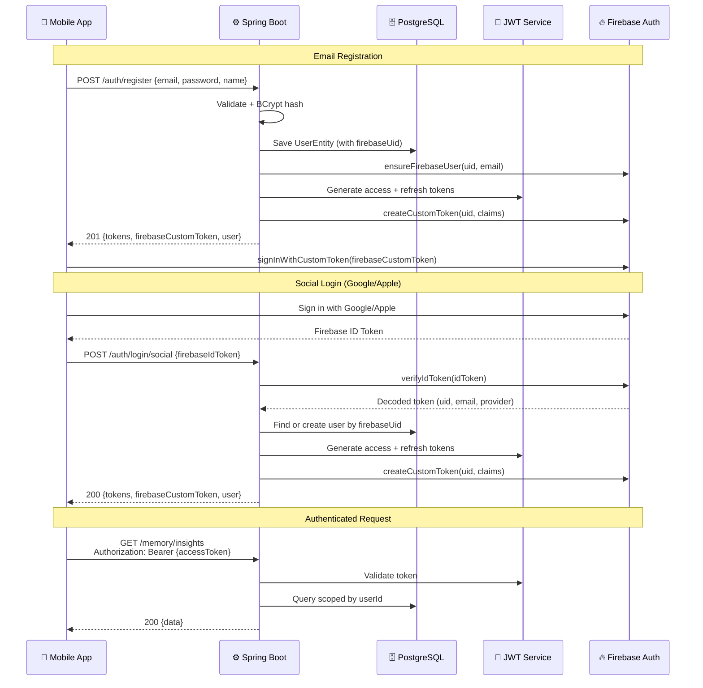

# 🔐 Authentication

## Auth Flow

### Dual Token Architecture

Every auth response returns **three tokens**:
1. **Backend JWT** — `accessToken` + `refreshToken` for API authorization
2. **Firebase Custom Token** — `firebaseCustomToken` for client-side `signInWithCustomToken()` to secure Firestore/Storage



## JWT Token Structure

### Access Token
- **Expiry:** 24 hours
- **Claims:** `userId`, `email`, `type: "access"`, `iat`, `exp`
- **Usage:** Sent in `Authorization: Bearer <token>` header

### Refresh Token
- **Expiry:** 30 days
- **Claims:** `userId`, `email`, `type: "refresh"`, `iat`, `exp`
- **Usage:** Sent to `/auth/refresh-token` to get new tokens + fresh Firebase custom token

### Firebase Custom Token
- **Expiry:** 1 hour (Firebase default)
- **Claims:** `backendUserId`
- **Usage:** Client calls `FirebaseAuth.signInWithCustomToken()` for Firestore/Storage access
- **Refresh:** A new custom token is returned on every `/refresh-token` call

## Social Login Integration

### Supported Providers
| Provider | Client SDK | Firebase Provider ID |
|----------|-----------|---------------------|
| Google | Google Sign-In | `google.com` |
| Apple | Sign in with Apple | `apple.com` |
| Email | Backend-owned | `EMAIL` |

### Account Linking
When a social user's email matches an existing email-registered user, the accounts are automatically linked (the `firebase_uid` is set on the existing user).

## Firebase Custom Token Service

```
FirebaseCustomTokenService
├── createCustomToken(uid, claims)  — mints Firebase custom token
├── verifyIdToken(idToken)          — verifies social login tokens
└── ensureFirebaseUser(uid, email)  — creates Firebase Auth user for email users
```

## Security Configuration

```java
.authorizeHttpRequests(auth -> auth
    .requestMatchers("/api/v1/auth/**").permitAll()
    .requestMatchers("/swagger-ui/**", "/v3/api-docs/**").permitAll()
    .requestMatchers("/actuator/health").permitAll()
    .anyRequest().authenticated()
)
```

## Password Policy

| Rule | Constraint |
|------|-----------| 
| Minimum length | 8 characters |
| Encoding | BCrypt (10 rounds) |
| Storage | `password_hash` column (nullable for social users) |

## FCM Token Management

```
PUT /api/v1/auth/update-fcm-token
Authorization: Bearer {accessToken}
{ "fcmToken": "dXY3..." }
```

## Environment Variables

| Variable | Description |
|----------|-------------|
| `JWT_SECRET` | HMAC signing key for backend JWTs |
| `FIREBASE_CREDENTIALS_PATH` | Path to Firebase Admin SDK service account JSON |
