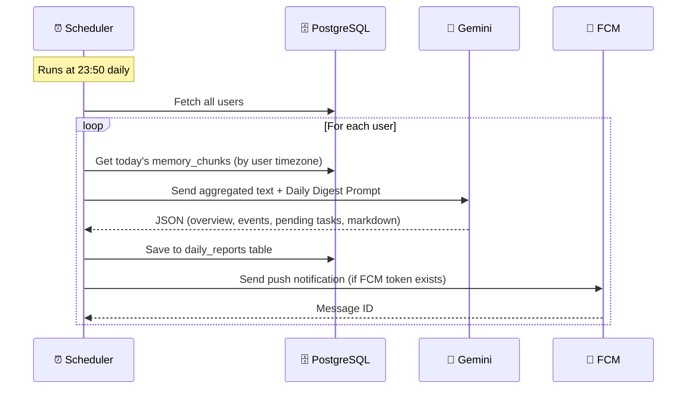

# 📊 Daily Digest

The Daily Digest is an automated end-of-day AI summary generated by a Spring Boot `@Scheduled` cron job.

## How It Works



## Scheduler Implementation

```java
@Service
@RequiredArgsConstructor
public class DailyDigestScheduler {
    private final UserRepository userRepository;
    private final MemoryChunkRepository chunkRepository;
    private final GeminiAiService geminiAiService;
    private final DailyReportRepository reportRepository;
    private final ObjectMapper objectMapper;
    private final FcmNotificationService fcmNotificationService;

    @Scheduled(cron = "0 50 23 * * ?")
    public void generateDailyReports() {
        List<UserEntity> users = userRepository.findAll();

        for (UserEntity user : users) {
            try {
                generateDigestForUser(user);
            } catch (Exception e) {
                log.error("Failed digest for user {}: {}", user.getId(), e.getMessage());
            }
        }
    }
}
```

## Timezone Handling

!!! important "User Timezone"
    Each user has a `timezone` field (e.g., `Africa/Cairo`, `Asia/Riyadh`). The cron job uses this to determine the user's "today" boundary.

```java
ZoneId userZone = ZoneId.of(user.getTimezone());
LocalDate userToday = LocalDate.now(userZone);
Instant dayStart = userToday.atStartOfDay(userZone).toInstant();
Instant dayEnd = userToday.plusDays(1).atStartOfDay(userZone).toInstant();
```

## Digest Output Structure

```json
{
  "day_overview": "يومك كان مليان اجتماعات ومهام عملية. اتكلمت مع أحمد...",
  "key_events": [
    "ميتنج مع فريق الـ React الساعة ١٠",
    "مكالمة مع العميل الجديد"
  ],
  "pending_tasks_for_tomorrow": [
    "إرسال الريبورت النهائي لأحمد",
    "متابعة عرض السعر مع العميل"
  ],
  "markdown_report": "## 📊 ملخص يومك\n\n✅ **إنجازات اليوم:**\n..."
}
```

## Idempotency

The scheduler checks `reportRepository.existsByUserIdAndReportDate()` before generating. If a digest already exists for a user/date pair, it is skipped. This makes the scheduler safe to re-run.

## Push Notification

!!! success "Implemented"
    FCM push notification is sent automatically after each digest generation using Firebase Admin SDK.

**Notification spec:**

| Field | Value |
|-------|-------|
| **Title** | `📋 ملخصك اليومي جاهز!` |
| **Body** | `{day_overview}` (truncated to 200 chars) |
| **Android** | High priority, `daily_digest` channel, default sound |
| **iOS** | Badge = 1, default sound |
| **Skip condition** | User has no FCM token registered |

**Implementation:** `FcmNotificationService` is called from `DailyDigestScheduler.sendDigestNotification()` after saving the report. If the user has no `fcmToken`, the notification is silently skipped.

