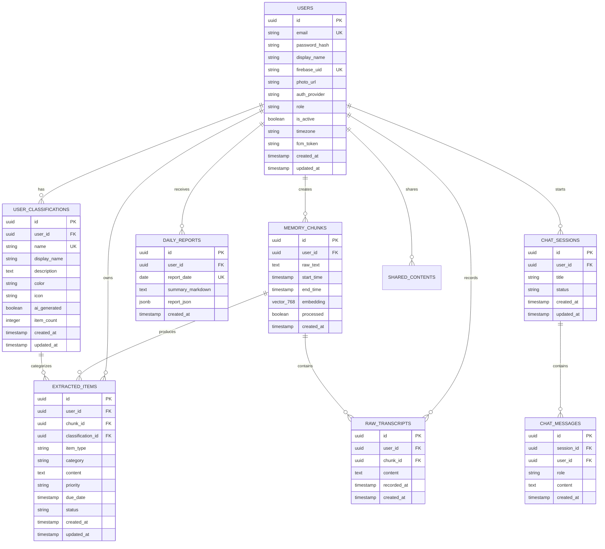

# 🗄️ Database Schema

PostgreSQL 16 with pgvector extension for embedding storage.

## ER Diagram

## Tables

### Core Tables

| Table | Purpose | Key Columns |
|-------|---------|-------------|
| `users` | User accounts (email + social auth) | email, firebase_uid, role, is_active |
| `memory_chunks` | Merged raw text from listening sessions | raw_text, embedding (vector 768), processed |
| `raw_transcripts` | Individual transcript entries (queryable by date) | content, recorded_at |
| `extracted_items` | AI-classified items (tasks, notes, reminders) | item_type, classification_id, content, status |
| `user_classifications` | Per-user dynamic AI-generated categories | name, display_name, color, icon, item_count |
| `daily_reports` | Daily AI-generated digests | report_date, summary_markdown, report_json |

### Chat Tables

| Table | Purpose | Key Columns |
|-------|---------|-------------|
| `chat_sessions` | RAG chat sessions | title, status |
| `chat_messages` | Individual chat messages | session_id, role, content |

### Sharing Tables

| Table | Purpose |
|-------|---------|
| `shared_contents` | Shared links with visibility control |
| `share_comments` | Comments on shared content |
| `share_access_grants` | Explicit access grants |
| `share_access_requests` | Access request workflow |

## Enums

| Enum | Values | Usage |
|------|--------|-------|
| `ItemType` | TASK, REMINDER, NOTE | Extracted item classification |
| `ItemStatus` | PENDING, DONE | Task completion state |
| `Priority` | HIGH, MEDIUM, LOW | Task urgency |
| `Category` | WORK, STUDY, PERSONAL, FINANCE, HEALTH, IDEAS, FAMILY | Legacy static categories (backward compat) |
| `UserRole` | USER, SUPER_ADMIN | Authorization level |
| `ChatSessionStatus` | ACTIVE, ARCHIVED | Chat session lifecycle |
| `ChatRole` | USER, ASSISTANT | Message sender |

!!! note "Dynamic vs Static Categories"
    The `Category` enum is retained for backward compatibility. New items use `classification_id` FK
    to `user_classifications` for AI-generated, per-user dynamic categories. The `category` column
    is populated alongside `classification_id` during migration.

## Indexes

| Table | Index | Type | Purpose |
|-------|-------|------|---------|
| `memory_chunks` | `embedding` | HNSW (vector_cosine_ops) | RAG similarity search |
| `memory_chunks` | `user_id, start_time` | B-tree | Date-range queries |
| `extracted_items` | `user_id, item_type` | B-tree | Type-filtered queries |
| `extracted_items` | `user_id, category` | B-tree | Category-filtered queries |
| `extracted_items` | `classification_id` | B-tree | Classification-filtered queries |
| `raw_transcripts` | `user_id, recorded_at DESC` | B-tree | Transcript date queries |
| `user_classifications` | `user_id` | B-tree | User's classifications |
| `user_classifications` | `user_id, name` | Unique | Prevent duplicate names |

## Migrations

| Version | Description |
|---------|-------------|
| V1 | Create users table |
| V2 | Enable pgvector, create memory_chunks + extracted_items + daily_reports |
| V3 | Create chat_messages |
| V4 | Add Firebase auth columns |
| V5 | Create sharing tables |
| V6 | Enhance sharing tables (visibility, access control) |
| V7 | Create chat_sessions, add session_id to messages |
| V8 | Add audit columns to sharing tables |
| V9 | Create files table |
| V10 | Add user role and active status |
| V11 | Dynamic user_classifications + raw_transcripts + classification_id FK |
