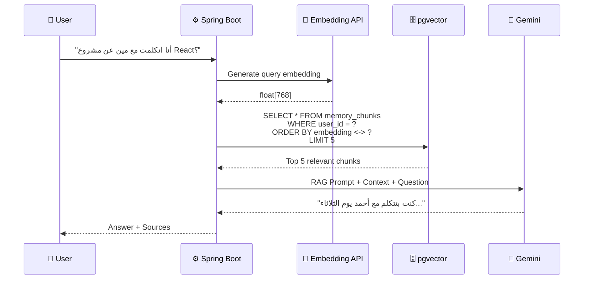

# 💬 RAG Pipeline (Chat with Memory)

The RAG (Retrieval-Augmented Generation) pipeline enables users to chat with their memory using natural language.

## How It Works



## Step-by-Step

### Step 1: Query Embedding

Convert the user's question into a vector using Gemini Embedding API:

```java
float[] queryEmbedding = geminiService.generateEmbedding(chatRequest.getQuery());
```

### Step 2: Vector Similarity Search

Find the most relevant memory chunks using pgvector's cosine distance operator:

```sql
SELECT id, raw_text, start_time,
       1 - (embedding <=> :queryEmbedding) AS similarity
FROM memory_chunks
WHERE user_id = :userId
ORDER BY embedding <=> :queryEmbedding
LIMIT 5
```

!!! info "Operator `<=>`"
    `<=>` is pgvector's cosine distance operator. Lower distance = higher similarity.
    `<->` is L2 (Euclidean) distance. We use cosine for text similarity.

### Step 3: Context Injection

Assemble the retrieved chunks into a context block for Gemini:

```java
String context = relevantChunks.stream()
    .map(chunk -> String.format("[%s] %s",
        chunk.getStartTime().toString(),
        chunk.getRawText()))
    .collect(Collectors.joining("\n\n"));
```

### Step 4: Generate Answer

Send the RAG prompt with context and question to Gemini:

```java
String answer = geminiService.chat(
    RAG_SYSTEM_PROMPT,
    context,
    chatRequest.getQuery()
);
```

## Response Format

```json
{
  "answer": "كنت بتتكلم مع أحمد يوم الثلاثاء عن مشروع React. ذكر إن الـ deadline يوم الجمعة.",
  "sources": [
    {
      "chunkId": "660e8400-...",
      "text": "أحمد بيقول إن مشروع React...",
      "timestamp": "2026-03-09T14:22:00Z",
      "similarity": 0.92
    },
    {
      "chunkId": "770e8400-...",
      "text": "الـ deadline بتاع React يوم الجمعة...",
      "timestamp": "2026-03-09T14:25:00Z",
      "similarity": 0.87
    }
  ]
}
```

## Performance Considerations

| Concern | Solution |
|---------|----------|
| **Search Speed** | HNSW index on `embedding` column for O(log n) search |
| **Result Quality** | Return top 5 chunks (configurable) |
| **Data Isolation** | `WHERE user_id = ?` ensures no cross-user data leakage |
| **Empty Results** | If no chunks have similarity > 0.5, respond with "no matching records" |
