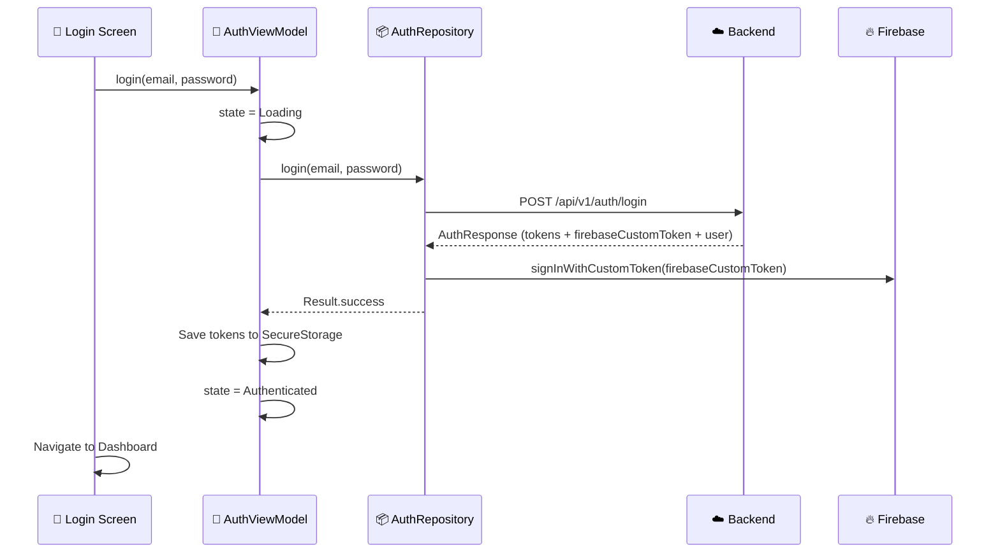
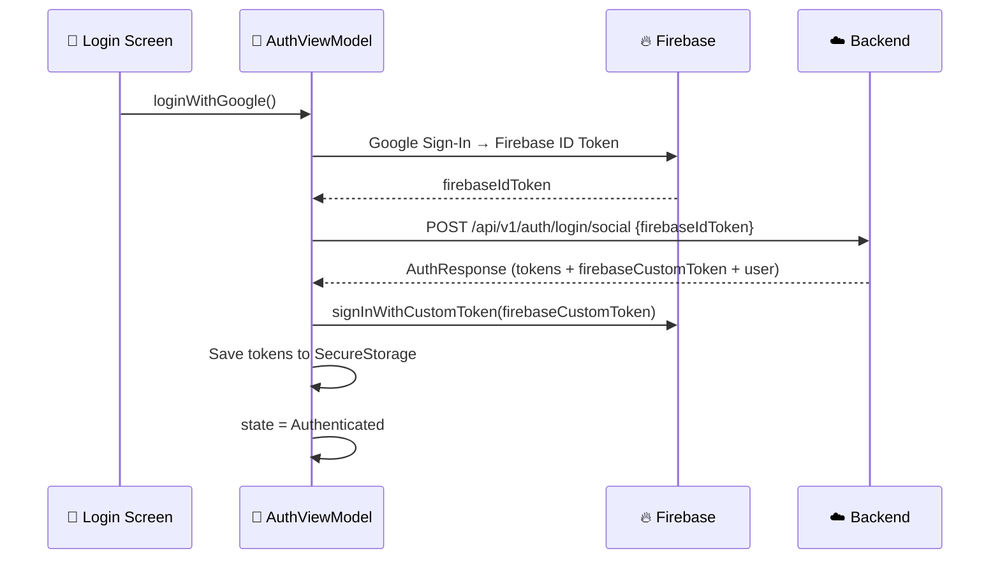

# 🔐 Authentication Feature

## Overview

User authentication with **email/password** and **social login** (Google, Apple), JWT tokens, Firebase custom tokens for Firestore access, and FCM device registration.

## Screens

### Login Page
- Email + password fields
- "Remember me" toggle
- **Google Sign-In** button
- **Apple Sign-In** button
- Link to Register page

### Register Page
- Email, password, display name, timezone (auto-detected)
- Password strength indicator
- Terms & privacy agreement checkbox

## Data Flow

### Email Login

### Social Login (Google/Apple)

## Business Rules

| Rule | Description |
|------|-------------|
| Email validation | Must be valid email format |
| Password minimum | 8 characters (email users only) |
| Duplicate email | Returns 409 error on register |
| Social account linking | Social login with existing email auto-links accounts |
| Token storage | Access + Refresh + Firebase tokens saved in DataStore/Keychain |
| Auto-login | On app start, check for valid access token |
| FCM registration | After login, send device FCM token to backend |
| Firebase session | Client must call `signInWithCustomToken()` for Firestore access |

## API Endpoints

| Method | Path | Description |
|--------|------|-------------|
| POST | `/api/v1/auth/register` | Email/password registration |
| POST | `/api/v1/auth/login` | Email/password login |
| POST | `/api/v1/auth/login/social` | Social login (Firebase ID Token) |
| POST | `/api/v1/auth/refresh-token` | Refresh all tokens |
| PUT | `/api/v1/auth/update-fcm-token` | Update FCM device token |
| GET | `/api/v1/auth/profile` | Get user profile |
| PUT | `/api/v1/auth/profile` | Update profile |
| PUT | `/api/v1/auth/change-password` | Change password (email users only) |
