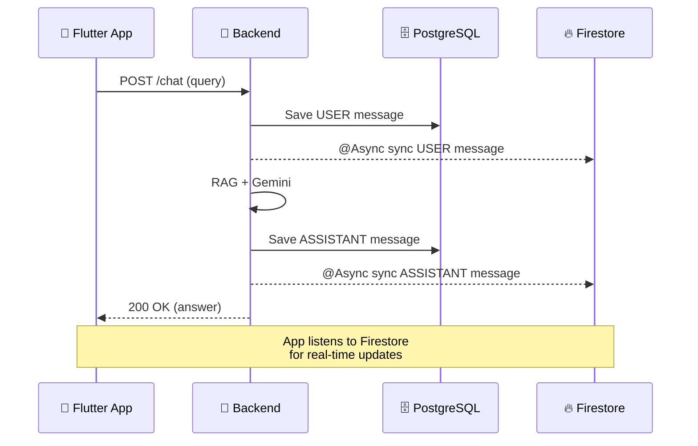

# 💬 Chat with Memory Feature

## Overview

A conversational UI where users ask natural language questions about their past conversations and the AI responds using RAG (Retrieval-Augmented Generation).

## UI Design

- **Chat bubble interface** — user messages on right, AI on left
- **Source citations** — expandable "Sources" section under each AI answer
- **Suggested questions** — pre-filled quick questions ("What did I discuss yesterday?")
- **Loading state** — typing indicator while AI processes

## Example Interactions

| User Question | AI Answer |
|--------------|-----------|
| "أنا كنت بتكلم مع مين عن مشروع React?" | "كنت بتتكلم مع أحمد يوم الثلاثاء. ذكر إن الـ deadline يوم الجمعة." |
| "فاكر الرقم اللي حد قالهولي امبارح؟" | "أكتر رقم اتذكر امبارح كان 0123456789 — ده رقم العميل الجديد." |
| "إيه المهام اللي مخلصتهاش الأسبوع ده؟" | "عندك 3 مهام معلقة: إرسال الريبورت، متابعة العميل، دفع الفاتورة." |

## Business Rules

| Rule | Description |
|------|-------------|
| Context limit | Top 5 most relevant chunks per query |
| No hallucination | AI only answers from user's data, never invents |
| Arabic response | AI always responds in Arabic |
| Source attribution | Each answer includes source chunks with timestamps |

## Real-Time Messaging via Firestore

Chat messages are synced in real-time to **Firestore** so the mobile app can use snapshot listeners instead of polling the REST API.

### Data Flow



### Architecture Decisions

| Decision | Rationale |
|----------|-----------|
| **Backend = source of truth** | PostgreSQL stores canonical data; Firestore is a read-only projection |
| **One-way sync** | Data flows only Backend → Firestore, never the reverse |
| **`@Async` writes** | Firestore sync happens in background, doesn't block chat response |
| **Console fallback** | In local dev (`app.firestore.provider=console`), sync is logged to console |
| **`@ConditionalOnProperty` switching** | `FirebaseChatFirestoreSyncService` (prod) vs `ConsoleChatFirestoreSyncService` (dev) |

### Firestore Collection Structure

```
edrak_chat_messages/{messageId}
├── id: string (UUID)
├── userId: string (UUID)
├── role: string ("USER" | "ASSISTANT")
├── content: string
└── createdAt: string (ISO-8601)
```

**Mobile query:** `edrak_chat_messages WHERE userId == X ORDER BY createdAt`

### Backend Implementation

| Class | Layer | Responsibility |
|-------|-------|---------------|
| `ChatFirestoreSyncService` | Core (Port) | Interface for Firestore sync operations |
| `FirebaseChatFirestoreSyncService` | Core (Adapter) | Production — writes to Firestore via Firebase Admin SDK |
| `ConsoleChatFirestoreSyncService` | Core (Adapter) | Dev — logs sync operations to console |
| `ChatMessageFirestoreDocument` | Core (DTO) | Flat POJO mapped from `ChatMessageEntity` |
| `MemoryServiceImpl` | Application | Calls sync after every `chatMessageRepository.save()` |
| `FirebaseConfig` | Infrastructure | Provides `Firestore` bean (conditional) |

### Configuration

| Environment | `FIRESTORE_PROVIDER` | Behavior |
|-------------|---------------------|----------|
| Local dev | `console` (default) | Logs sync to console |
| Production | `firebase` | Writes to Firestore |

### REST Fallback

The `GET /api/v1/memory/chat/history` endpoint remains available for:

- Initial paginated message load
- Offline fallback when Firestore is unavailable
- Web clients that don't use Firestore listeners
