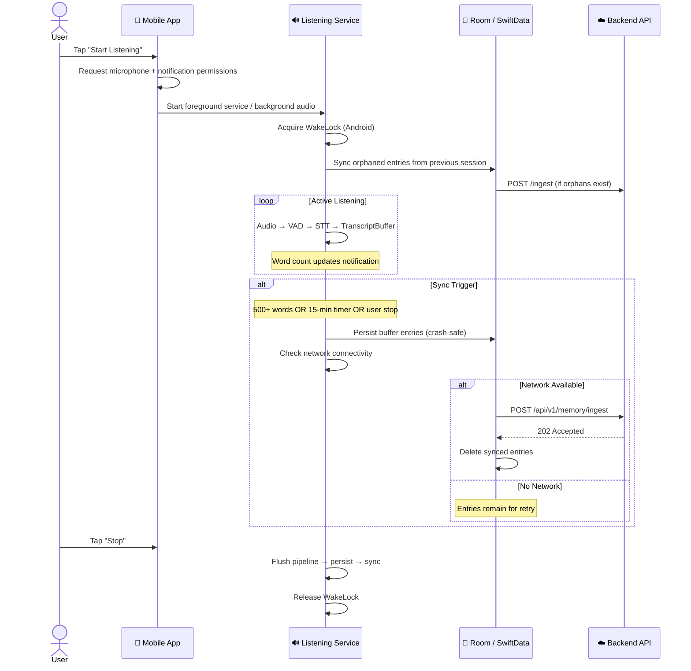

# 🎙️ Memory Ingestion

The memory ingestion feature captures spoken words, transcribes them on-device, and syncs to the backend for AI classification.

## User Flow



## Sync Triggers

| Trigger | Description | Platform |
|---------|-------------|----------|
| ⏹️ **User Stop** | User taps Stop on notification/UI | Both |
| 📝 **Word Threshold** | Buffer exceeds **500 words** | Both |
| ⏰ **Time Threshold** | **15 minutes** since last sync | Both |
| 🔄 **Orphan Recovery** | On service start, syncs entries from previous session | Both |

## Crash Safety

```
RAM Buffer → Room/SwiftData (disk) → API → Delete from disk
```

| Scenario | What Happens |
|----------|-------------|
| App killed by OS | Entries in Room/SwiftData survive. Synced on next launch. |
| Network drops during sync | Entries remain in local DB for retry. |
| Server returns error | Entries stay in local DB. Consecutive failure backoff (max 5). |
| Device reboots | Room/SwiftData persists across reboots. |
| Sync succeeds | Entries deleted from local DB immediately. |

## Backend Processing

When the backend receives `POST /api/v1/memory/ingest`:

1. **Save raw text** to `memory_chunks` table
2. **Save individual entries** to `raw_transcripts` table (user-queryable)
3. **Return 202 Accepted** immediately (async processing)
4. **Generate embedding** (Gemini text-embedding-004, 768 dimensions)
5. **Classify with AI** using user's existing dynamic classifications
6. **Create/update classifications** in `user_classifications` table
7. **Save extracted items** (tasks, notes, reminders) linked to classifications

## API Contract

### Request

```http
POST /api/v1/memory/ingest
Authorization: Bearer <jwt>
Content-Type: application/json

{
  "texts": [
    {
      "content": "لازم أبعت الريبورت لأحمد بكرة الصبح",
      "timestamp": "2026-03-12T10:30:00Z"
    }
  ]
}
```

### Response

```http
HTTP/1.1 202 Accepted

{
  "success": true,
  "message": "Ingestion accepted. Processing in background.",
  "data": {
    "chunkId": "550e8400-e29b-41d4-a716-446655440000",
    "textsReceived": 1
  }
}
```

## Platform Components

| Component | Android | iOS |
|-----------|---------|-----|
| Service | `EdrakListeningService` (LifecycleService) | `ListeningService` (@Observable) |
| Audio | `AudioRecord` (16kHz mono float) | `AVAudioEngine` + `installTap` |
| VAD | `EnergyVadService` (synchronized) | `EnergyVADService` (Accelerate) |
| STT | `MockSttService` (Phase A) | `MockSTTService` (Phase A) |
| Buffer | `TranscriptBuffer` (@Synchronized, O(1) word count) | `TranscriptBuffer` (actor) |
| Persistence | Room `PendingTranscriptEntity` | SwiftData `PendingTranscript` |
| Sync | `SyncEngine` (Mutex + ConnectivityManager) | `SyncEngine` (NWPathMonitor) |
| State | `ListeningStateHolder` (StateFlow) | Built into `ListeningService` |
| CPU keep-alive | `PARTIAL_WAKE_LOCK` | Background audio mode |
