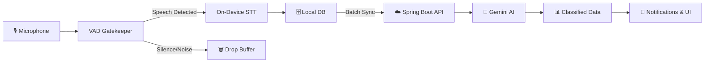

# 🧠 Edrak (إدراك) — The AI Second Brain

> **"Your silent memory. It listens, organizes, and remembers so you don't have to."**

---

## What is Edrak?

**Edrak** (إدراك — meaning *Cognition, Realization, and Deep Understanding* in Arabic) is an AI-powered personal memory assistant that runs silently in the background, listening to your conversations (with your explicit consent), and automatically organizing everything into:

- ✅ **Tasks** with priorities
- 📝 **Notes** with context
- ⏰ **Reminders** with extracted times
- 📂 **Categories** (Work, Study, Personal, Finance, Health, Ideas, Family)
- 📊 **Daily Digests** — end-of-day AI summaries

## Core Values

| Value | Description |
|-------|-------------|
| 🔒 **Absolute Privacy** | Audio **NEVER** leaves the device. Only transcribed text is securely synced. |
| 🔋 **Battery Excellence** | Zero-drain background processing using low-level C++ Voice Activity Detection. |
| 🤖 **Seamless Automation** | Requires minimal user intervention after initial setup. |

## Architecture at a Glance

## Quick Links

| Section | Description |
|---------|-------------|
| [🚀 Getting Started](getting-started.md) | Set up your development environment |
| [🏗️ Architecture](architecture/system-overview.md) | System design and data flow |
| [⚙️ Backend](backend/overview.md) | Spring Boot API, database, AI pipeline |
| [📱 Mobile](mobile/overview.md) | Native Android + iOS apps |
| [🔒 Security](security/privacy-architecture.md) | Privacy shields and data protection |
| [🧩 Features](features/auth.md) | Feature-by-feature documentation |
| [🛠️ Development](development/setup.md) | Dev guides and coding standards |

## Tech Stack

| Layer | Technology |
|-------|-----------|
| **Android** | Kotlin + Jetpack Compose + Hilt + Coroutines |
| **iOS** | Swift + SwiftUI + Swift Concurrency |
| **Backend** | Java 17 + Spring Boot 3.x |
| **Database** | PostgreSQL 16 + pgvector |
| **AI Engine** | Google Gemini 1.5 Flash |
| **On-Device STT** | Vosk / Whisper.cpp (offline) |
| **On-Device VAD** | Silero VAD (C++ via JNI/NDK) |
| **Auth** | JWT (Access + Refresh tokens) |
| **Push** | Firebase Cloud Messaging (FCM) |

---

**Version:** 1.0.0 | **Platforms:** iOS (SwiftUI), Android (Compose) | **Language:** Arabic-first, English support
