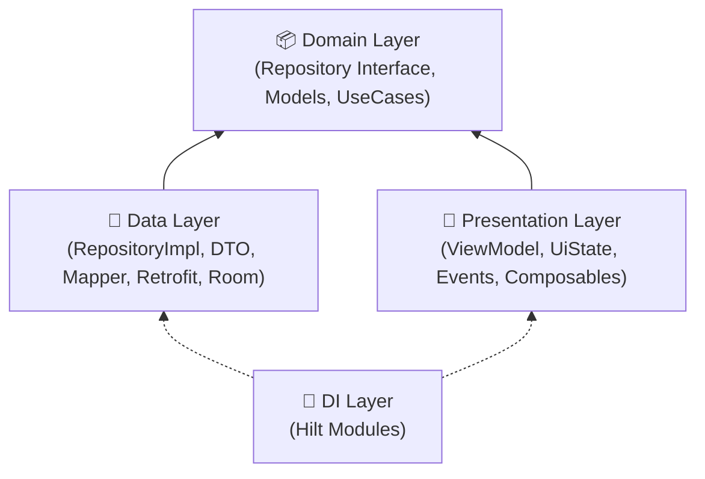

# 🏗️ Android Clean Architecture

## Architecture Layers



## Domain Layer (No framework dependencies)

### Domain Model

```kotlin
// Pure Kotlin — no annotations, no framework deps
data class Insight(
    val id: String,
    val category: String,
    val summary: String,
    val tasks: List<Task>,
    val notes: List<String>,
    val createdAt: LocalDateTime,
)

data class Task(
    val name: String,
    val priority: Priority,
    val status: TaskStatus,
)

enum class Priority { HIGH, MEDIUM, LOW }
enum class TaskStatus { PENDING, DONE }
```

### Repository Interface

```kotlin
interface MemoryRepository {
    suspend fun getInsights(date: String, category: String?): Result<List<Insight>>
    suspend fun ingestTranscripts(entries: List<TranscriptEntry>): Result<Unit>
    suspend fun chatWithMemory(query: String): Result<ChatResponse>
    fun observeInsights(date: String): Flow<List<Insight>>
}
```

### UseCase

```kotlin
class GetInsightsUseCase @Inject constructor(
    private val repository: MemoryRepository,
) {
    suspend operator fun invoke(
        date: String,
        category: String? = null,
    ): Result<List<Insight>> = repository.getInsights(date, category)
}
```

!!! tip "UseCase Rules"
    - One public method per UseCase (`invoke` operator for Kotlin)
    - Each UseCase has **exactly one responsibility**
    - UseCases can call other UseCases (composition)
    - Never inject framework types (Context, Activity)

## Data Layer

### DTO (Data Transfer Object)

```kotlin
@Serializable
data class InsightDto(
    val id: String,
    val category: String,
    val summary: String,
    val tasks: List<TaskDto>,
    val notes: List<String>,
    @SerialName("created_at")
    val createdAt: String,
)

@Serializable
data class TaskDto(
    @SerialName("task_name")
    val taskName: String,
    val priority: String,
    val status: String,
)
```

### Mapper

```kotlin
@Singleton
class InsightMapper @Inject constructor() {
    fun toDomain(dto: InsightDto): Insight = Insight(
        id = dto.id,
        category = dto.category,
        summary = dto.summary,
        tasks = dto.tasks.map { taskToDomain(it) },
        notes = dto.notes,
        createdAt = LocalDateTime.parse(dto.createdAt),
    )

    private fun taskToDomain(dto: TaskDto): Task = Task(
        name = dto.taskName,
        priority = Priority.valueOf(dto.priority),
        status = TaskStatus.valueOf(dto.status),
    )
}
```

### Repository Implementation

```kotlin
class MemoryRepositoryImpl @Inject constructor(
    private val api: EdrakApiService,
    private val mapper: InsightMapper,
    private val insightDao: InsightDao,
) : MemoryRepository {

    override suspend fun getInsights(
        date: String,
        category: String?,
    ): Result<List<Insight>> = runCatching {
        val response = api.getInsights(date, category)
        response.data.map(mapper::toDomain)
    }

    override fun observeInsights(date: String): Flow<List<Insight>> =
        insightDao.observeByDate(date).map { entities ->
            entities.map(mapper::entityToDomain)
        }
}
```

### Retrofit API Service

```kotlin
interface EdrakApiService {
    @GET("api/v1/memory/insights")
    suspend fun getInsights(
        @Query("date") date: String,
        @Query("category") category: String?,
    ): ApiResponse<List<InsightDto>>

    @POST("api/v1/memory/ingest")
    suspend fun ingestTranscripts(
        @Body request: IngestRequest,
    ): ApiResponse<Unit>

    @POST("api/v1/memory/chat")
    suspend fun chatWithMemory(
        @Body request: ChatRequest,
    ): ApiResponse<ChatResponseDto>
}
```

## Dependency Injection (Hilt)

### Module Structure

```kotlin
// Network
@Module
@InstallIn(SingletonComponent::class)
object NetworkModule {
    @Provides
    @Singleton
    fun provideOkHttpClient(tokenManager: TokenManager): OkHttpClient =
        OkHttpClient.Builder()
            .addInterceptor(AuthInterceptor(tokenManager))
            .build()

    @Provides
    @Singleton
    fun provideRetrofit(client: OkHttpClient): Retrofit =
        Retrofit.Builder()
            .baseUrl(BuildConfig.API_BASE_URL)
            .client(client)
            .addConverterFactory(Json.asConverterFactory("application/json".toMediaType()))
            .build()

    @Provides
    @Singleton
    fun provideEdrakApi(retrofit: Retrofit): EdrakApiService =
        retrofit.create(EdrakApiService::class.java)
}

// Repositories
@Module
@InstallIn(SingletonComponent::class)
abstract class RepositoryModule {
    @Binds
    @Singleton
    abstract fun bindMemoryRepository(impl: MemoryRepositoryImpl): MemoryRepository

    @Binds
    @Singleton
    abstract fun bindAuthRepository(impl: AuthRepositoryImpl): AuthRepository
}
```

### Scoping

| Scope | Annotation | Lifecycle |
|-------|-----------|-----------|
| App-wide | `@Singleton` | Application process |
| ViewModel | `@ViewModelScoped` | ViewModel lifecycle |
| Activity | `@ActivityScoped` | Activity lifecycle |

## Feature Checklist

When creating a new feature:

- [ ] **1.** Create domain model in `domain/model/`
- [ ] **2.** Create repository interface in `domain/repository/`
- [ ] **3.** Create DTOs in `data/dto/`
- [ ] **4.** Create mapper in `data/mapper/`
- [ ] **5.** Create repository impl in `data/repository/`
- [ ] **6.** Create UseCase(s) in `domain/usecase/`
- [ ] **7.** Add API endpoints to `EdrakApiService`
- [ ] **8.** Create UiState + Event in `presentation/`
- [ ] **9.** Create ViewModel in `presentation/`
- [ ] **10.** Create Screen composable in `presentation/`
- [ ] **11.** Register bindings in Hilt `@Module`
- [ ] **12.** Add route to navigation graph
- [ ] **13.** Add strings to `strings.xml` (EN + AR)
