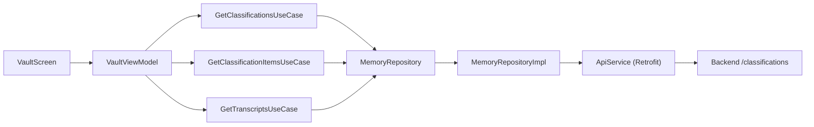

# Dynamic Classifications

Backend-driven classification system — all categories are created by AI during text processing, with no static client-side classification.

## Architecture



## Backend Endpoints

| Method | Endpoint | Android Method | Purpose |
|--------|----------|---------------|---------|
| `GET` | `/classifications` | `getClassifications()` | List all user classifications |
| `GET` | `/classifications/{id}` | `getClassification()` | Single classification detail |
| `GET` | `/classifications/{id}/items` | `getClassificationItems()` | Items under a classification |
| `PUT` | `/classifications/{id}` | `updateClassification()` | Update display properties |
| `DELETE` | `/classifications/{id}` | `deleteClassification()` | Delete classification |
| `GET` | `/classifications/analytics` | `getClassificationAnalytics()` | Analytics breakdown |
| `GET` | `/transcripts` | `getTranscripts()` | Paginated raw transcripts |

## Vault Screen (3 Tabs)

### Tab 1: All Items
- Displays insights with type filters (All, Tasks, Notes, Reminders)
- Date filter (Today toggle)
- Stats summary (total tasks, notes, reminders)
- Search across all items

### Tab 2: Classifications
- Lists AI-generated classifications from backend
- Tap to drill down into classification items
- Type filter within classification (task, note, reminder)
- Animated transitions between list and detail view
- Empty state messaging when backend has no classifications

### Tab 3: Journal
- Paginated raw transcripts from backend
- Infinite scroll (load more on scroll to bottom)
- Search within transcripts

## Key DTOs

### ClassificationDto
```kotlin
data class ClassificationDto(
    val id: String,
    val name: String,
    val displayName: String?,
    val description: String?,
    val color: String?,
    val icon: String?,
    val aiGenerated: Boolean,
    val itemCount: Int,
    val itemsByType: Map<String, Long>?,
    val createdAt: String?,
)
```

### TranscriptDto
```kotlin
data class TranscriptDto(
    val id: String,
    val content: String,
    val recordedAt: String,
    val createdAt: String?,
)
```

## VaultViewModel Events

| Event | Action |
|-------|--------|
| `LoadInsights` | Fetch insights + stats |
| `FilterByType` | Filter by InsightType |
| `FilterByDate` | Filter by date |
| `ToggleInsightStatus` | Toggle PENDING ↔ DONE |
| `LoadClassifications` | Fetch from backend |
| `SelectClassification` | Drill into items |
| `ClearSelectedClassification` | Back to list |
| `FilterClassificationItemsByType` | Filter items by type |
| `LoadTranscripts` | Initial load (page 0) |
| `LoadMoreTranscripts` | Next page |
| `UpdateSearchQuery` | Filter all lists locally |
