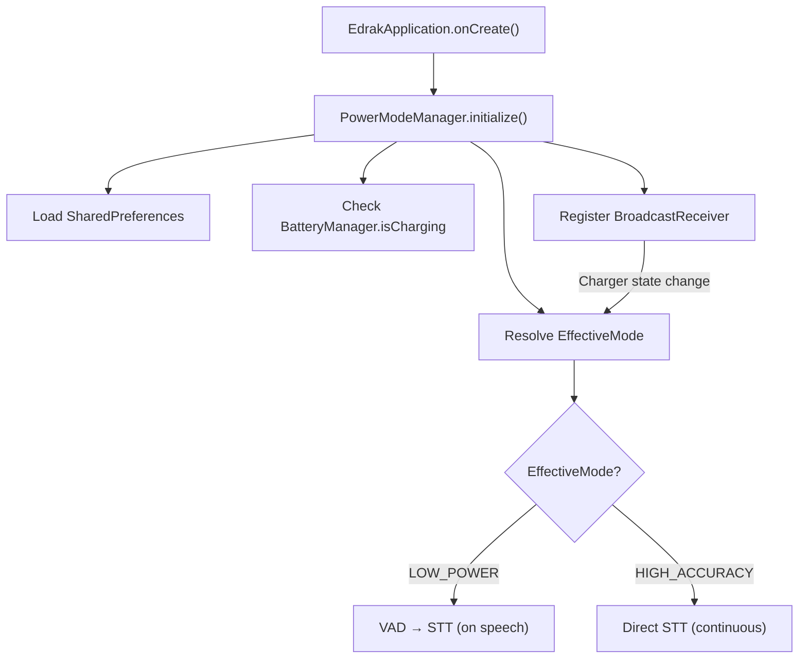

# Power Mode System

The power mode system dynamically adjusts the app's processing intensity based on battery status & user preference.

## Modes

| Mode | Description | Effective Mode |
|------|------------|---------------|
| **Battery Saver** | Always uses low-power pipeline | `LOW_POWER` |
| **Auto** (default) | Charging → high accuracy, Battery → low power | Depends on charger |
| **Max Performance** | Always uses high-accuracy pipeline | `HIGH_ACCURACY` |

## Architecture



### Component Integration

| Component | How It Uses Power Mode |
|-----------|----------------------|
| `AudioPipeline` | Switches between VAD-first (LOW_POWER) and continuous STT (HIGH_ACCURACY) |
| `SyncEngine` | Adaptive batch size: 50 (HIGH_ACCURACY) / 25 (LOW_POWER) |
| `EdrakListeningService` | Dynamic sync interval: 15s (HIGH_ACCURACY) / 60s (LOW_POWER) |
| `SettingsScreen` | 3 radio buttons + charger status indicator |

## Key Files

| File | Purpose |
|------|---------|
| `PowerMode.kt` | Enum: `BATTERY_SAVER`, `AUTO`, `MAX_PERFORMANCE` |
| `EffectiveMode.kt` | Enum: `LOW_POWER`, `HIGH_ACCURACY` |
| `PowerModeManager.kt` | Orchestrator — charger monitoring, mode resolution, reactive flows |
| `PowerModePreferences.kt` | SharedPreferences persistence |

## Effective Mode Resolution

```kotlin
fun resolveEffectiveMode() = when (selectedMode) {
    BATTERY_SAVER    → LOW_POWER
    MAX_PERFORMANCE  → HIGH_ACCURACY
    AUTO             → if (isCharging) HIGH_ACCURACY else LOW_POWER
}
```

## Audio Pipeline Behavior

### LOW_POWER Mode (Battery Saver / Auto on Battery)
```
VAD (8kHz mono, ~1% CPU) → Speech Detected → SpeechRecognizer → Result → Back to VAD
```

### HIGH_ACCURACY Mode (Max Performance / Auto on Charger)
```
SpeechRecognizer (continuous) → Result → Restart STT immediately (no VAD)
```

The pipeline observes `PowerModeManager.effectiveMode` via `StateFlow` and dynamically switches between modes when the charger state changes.

## Sync Behavior

| Parameter | LOW_POWER | HIGH_ACCURACY |
|-----------|-----------|---------------|
| Sync interval | 60 seconds | 15 seconds |
| Batch size | 25 entries | 50 entries |
| Aggressive sync | No (`shouldSync()` check) | Yes (skip threshold check) |

## Settings UI

The Settings screen displays:

- **Three radio options**: Auto, Max Performance, Battery Saver
- **Charger status badge**: Shows ⚡ when charging
- **Description text**: Explains each mode's behavior
