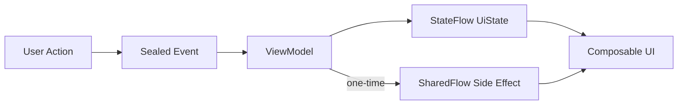

# 🔄 Android State Management

## Architecture: MVI (Model-View-Intent)



## Core Components

### UiState — Immutable Data Class

Represents the **entire** screen state at any moment:

```kotlin
data class InsightsUiState(
    val status: InsightsStatus = InsightsStatus.Idle,
    val insights: List<Insight> = emptyList(),
    val selectedCategory: String? = null,
    val selectedDate: String = LocalDate.now().toString(),
    val message: String? = null,
)

sealed interface InsightsStatus {
    data object Idle : InsightsStatus
    data object Loading : InsightsStatus
    data object Loaded : InsightsStatus
    data object Error : InsightsStatus
}
```

### Events — Sealed Interface

User **intents** that trigger state changes:

```kotlin
sealed interface InsightsEvent {
    data class LoadInsights(val date: String) : InsightsEvent
    data class FilterByCategory(val category: String?) : InsightsEvent
    data class CompleteTask(val taskId: String) : InsightsEvent
    data object RefreshInsights : InsightsEvent
    data object DismissError : InsightsEvent
}
```

### Side Effects — One-Time Actions

For navigation, snackbars, and other non-state events:

```kotlin
sealed interface InsightsEffect {
    data class ShowSnackbar(val message: String) : InsightsEffect
    data class NavigateToDetail(val insightId: String) : InsightsEffect
}
```

## ViewModel

```kotlin
@HiltViewModel
class InsightsViewModel @Inject constructor(
    private val getInsightsUseCase: GetInsightsUseCase,
    private val completeTaskUseCase: CompleteTaskUseCase,
) : ViewModel() {

    // ----- State -----
    private val _uiState = MutableStateFlow(InsightsUiState())
    val uiState: StateFlow<InsightsUiState> = _uiState.asStateFlow()

    // ----- Side Effects -----
    private val _effects = Channel<InsightsEffect>(Channel.BUFFERED)
    val effects: Flow<InsightsEffect> = _effects.receiveAsFlow()

    // ----- Event Handler -----
    fun onEvent(event: InsightsEvent) {
        when (event) {
            is InsightsEvent.LoadInsights -> loadInsights(event.date)
            is InsightsEvent.FilterByCategory -> filterByCategory(event.category)
            is InsightsEvent.CompleteTask -> completeTask(event.taskId)
            InsightsEvent.RefreshInsights -> loadInsights(_uiState.value.selectedDate)
            InsightsEvent.DismissError -> _uiState.update { it.copy(status = InsightsStatus.Idle, message = null) }
        }
    }

    private fun loadInsights(date: String) {
        viewModelScope.launch {
            _uiState.update { it.copy(status = InsightsStatus.Loading, selectedDate = date) }
            getInsightsUseCase(date, _uiState.value.selectedCategory)
                .onSuccess { insights ->
                    _uiState.update { it.copy(status = InsightsStatus.Loaded, insights = insights) }
                }
                .onFailure { error ->
                    _uiState.update { it.copy(status = InsightsStatus.Error, message = error.message) }
                }
        }
    }

    private fun filterByCategory(category: String?) {
        _uiState.update { it.copy(selectedCategory = category) }
        loadInsights(_uiState.value.selectedDate)
    }

    private fun completeTask(taskId: String) {
        viewModelScope.launch {
            completeTaskUseCase(taskId)
                .onSuccess {
                    _effects.send(InsightsEffect.ShowSnackbar("Task completed!"))
                    loadInsights(_uiState.value.selectedDate)
                }
                .onFailure { error ->
                    _effects.send(InsightsEffect.ShowSnackbar("Failed: ${error.message}"))
                }
        }
    }
}
```

## Composable Screen

```kotlin
@Composable
fun InsightsScreen(
    viewModel: InsightsViewModel = hiltViewModel(),
    onNavigateToDetail: (String) -> Unit,
) {
    val uiState by viewModel.uiState.collectAsStateWithLifecycle()
    val snackbarHostState = remember { SnackbarHostState() }

    // Collect side effects
    LaunchedEffect(Unit) {
        viewModel.effects.collect { effect ->
            when (effect) {
                is InsightsEffect.ShowSnackbar -> snackbarHostState.showSnackbar(effect.message)
                is InsightsEffect.NavigateToDetail -> onNavigateToDetail(effect.insightId)
            }
        }
    }

    Scaffold(
        snackbarHost = { SnackbarHost(snackbarHostState) },
    ) { padding ->
        when (uiState.status) {
            InsightsStatus.Loading -> LoadingIndicator(modifier = Modifier.padding(padding))
            InsightsStatus.Error -> ErrorView(
                message = uiState.message,
                onRetry = { viewModel.onEvent(InsightsEvent.RefreshInsights) },
                modifier = Modifier.padding(padding),
            )
            InsightsStatus.Loaded -> InsightsContent(
                insights = uiState.insights,
                selectedCategory = uiState.selectedCategory,
                onCategorySelected = { viewModel.onEvent(InsightsEvent.FilterByCategory(it)) },
                onTaskCompleted = { viewModel.onEvent(InsightsEvent.CompleteTask(it)) },
                modifier = Modifier.padding(padding),
            )
            InsightsStatus.Idle -> Unit
        }
    }
}
```

## Flow Patterns

### Observing Reactive Data (Room → UI)

```kotlin
@HiltViewModel
class DashboardViewModel @Inject constructor(
    private val repository: MemoryRepository,
) : ViewModel() {

    val insights: StateFlow<List<Insight>> = repository
        .observeInsights(LocalDate.now().toString())
        .stateIn(
            scope = viewModelScope,
            started = SharingStarted.WhileSubscribed(5_000),
            initialValue = emptyList(),
        )
}
```

### Debounced Search

```kotlin
private val _searchQuery = MutableStateFlow("")

init {
    viewModelScope.launch {
        _searchQuery
            .debounce(300)
            .distinctUntilChanged()
            .filter { it.length >= 2 }
            .collectLatest { query ->
                searchMemory(query)
            }
    }
}

fun onSearchChanged(query: String) {
    _searchQuery.value = query
}
```

### Combine Multiple Flows

```kotlin
val dashboardState: StateFlow<DashboardUiState> = combine(
    repository.observeInsights(today),
    repository.observePendingTasks(),
    settingsRepository.observeSchedule(),
) { insights, tasks, schedule ->
    DashboardUiState(
        insights = insights,
        pendingTasks = tasks,
        schedule = schedule,
    )
}.stateIn(viewModelScope, SharingStarted.WhileSubscribed(5_000), DashboardUiState())
```

## Rules

!!! danger "State Management Rules"
    1. **Single source of truth:** One `StateFlow<UiState>` per ViewModel
    2. **Immutable state:** Always use `data class` with `copy()`
    3. **No mutable state in composables:** Use `collectAsStateWithLifecycle` — NEVER `collectAsState`
    4. **Events through ViewModel:** Composables send events, never modify state directly
    5. **Side effects via Channel/SharedFlow:** Navigation, snackbars, and toasts are NEVER part of UiState
    6. **SharingStarted.WhileSubscribed(5_000):** Use 5-second timeout for `stateIn` to survive config changes
    7. **`viewModelScope`:** All coroutines launched in `viewModelScope` — NEVER `GlobalScope`
