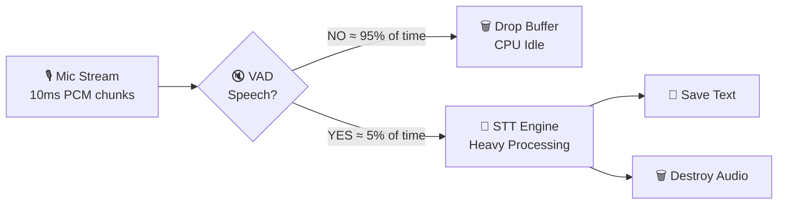

# 🔋 Battery Optimization

Battery optimization is the **most critical** mobile engineering concern for Edrak. A poorly optimized always-listening app would drain a phone battery in 2-3 hours.

## The VAD Gatekeeper Strategy



The key insight: **most of the time, there's no speech**. The VAD gatekeeper ensures the expensive STT engine only runs when absolutely necessary.

## Battery Budget

| Component | CPU Usage | Battery Impact | Active Time |
|-----------|----------|----------------|-------------|
| **VAD** (Silero) | < 1% | Negligible | 100% (always on) |
| **STT** (Vosk) | 15-30% | Moderate | ~5% (only during speech) |
| **Network Sync** | Brief spike | Low | Every 15 min |
| **Total estimated** | ~2-3% avg | ✅ Acceptable | — |

## Optimization Techniques

### 1. VAD-Gated STT

=== "Android (Kotlin)"

    ```kotlin
    class AudioPipeline @Inject constructor(
        private val vadService: VadService,
        private val sttService: SttService,
        private val transcriptBuffer: TranscriptBuffer,
    ) {
        private val speechBuffer = mutableListOf<FloatArray>()
        private var silenceCounter = 0

        fun processAudioChunk(chunk: FloatArray) {
            val isSpeech = vadService.detect(chunk)

            if (isSpeech) {
                speechBuffer.add(chunk)
                silenceCounter = 0
            } else {
                silenceCounter++
                // If 3 seconds of silence after speech, flush
                if (speechBuffer.isNotEmpty() && silenceCounter > 300) {
                    val text = sttService.transcribe(speechBuffer)
                    transcriptBuffer.append(text)
                    speechBuffer.clear()
                }
            }
        }
    }
    ```

=== "iOS (Swift)"

    ```swift
    final class AudioPipeline {
        private let vadService: VADServiceProtocol
        private let sttService: STTServiceProtocol
        private let transcriptBuffer: TranscriptBufferProtocol

        private var speechBuffer: [Data] = []
        private var silenceCounter = 0

        func processAudioChunk(_ chunk: Data) {
            let isSpeech = vadService.detect(chunk)

            if isSpeech {
                speechBuffer.append(chunk)
                silenceCounter = 0
            } else {
                silenceCounter += 1
                if !speechBuffer.isEmpty && silenceCounter > 300 {
                    let text = sttService.transcribe(speechBuffer)
                    transcriptBuffer.append(text)
                    speechBuffer.removeAll()
                }
            }
        }
    }
    ```

### 2. Lazy Network Batching

**DON'T** send HTTP requests for every sentence. This wakes the radio chip each time.

**DO** batch locally and sync only when:
- User stops the service
- Buffer exceeds 500 words
- 15 minutes since last sync

### 3. Audio Buffer Management

```
✅ DO: Keep audio in RAM buffers (FloatArray / Data)
✅ DO: Destroy buffers immediately after STT
❌ DON'T: Write audio to disk
❌ DON'T: Keep audio files around
```

### 4. Efficient Sampling

| Parameter | Value | Reason |
|-----------|-------|--------|
| Sample rate | 16000 Hz | Optimal for speech (not music) |
| Channels | Mono | Speech only needs 1 channel |
| Bit depth | 16-bit | Sufficient for STT accuracy |
| Chunk size | 10ms | Fast enough for VAD response |

## Testing Battery Impact

=== "Android"

    ```bash
    # Generate battery dump
    adb shell dumpsys batterystats --reset
    # Run app for 1 hour
    adb bugreport > bugreport.zip
    # Analyze with Battery Historian
    ```

=== "iOS"

    ```
    Xcode → Product → Profile → Energy Log (Instruments)
    Monitor energy impact over 1 hour session
    ```
