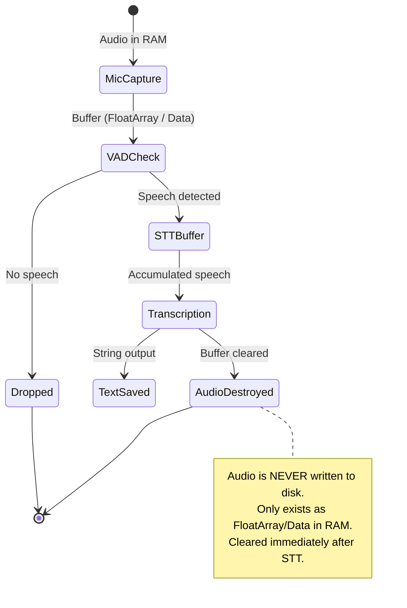

# 🎙️ On-Device STT

Speech-to-Text is performed **entirely on the device** — no audio is ever sent to the cloud.

## Engine Options

| Engine | Size | Accuracy (Arabic) | Speed | Recommended |
|--------|------|-------------------|-------|-------------|
| **Vosk** | ~50MB | Good | Fast | ✅ Primary |
| **Whisper.cpp** (tiny) | ~75MB | Very Good | Moderate | Alternative |
| **Whisper.cpp** (base) | ~150MB | Excellent | Slower | Quality priority |

!!! tip "Recommendation"
    Start with **Vosk** for its speed and small model size. Switch to **Whisper.cpp** if Arabic accuracy needs improvement.

## Native Integration

=== "Android (JNI/NDK)"

    Vosk provides a Java/Kotlin library that wraps native C++ code via JNI:

    ```kotlin
    class SttService @Inject constructor(
        @ApplicationContext private val context: Context,
    ) {
        private var recognizer: Recognizer? = null

        suspend fun initialize() = withContext(Dispatchers.IO) {
            val modelPath = SttModelManager.getModelPath(context)
            val model = Model(modelPath)
            recognizer = Recognizer(model, 16000f)
        }

        suspend fun transcribe(audioBuffers: List<FloatArray>): String = withContext(Dispatchers.IO) {
            val recognizer = recognizer ?: throw IllegalStateException("STT not initialized")
            for (buffer in audioBuffers) {
                val bytes = floatArrayToByteArray(buffer)
                recognizer.acceptWaveForm(bytes, bytes.size)
            }
            val result = recognizer.finalResult
            return@withContext parseText(result)
        }

        fun release() {
            recognizer?.close()
            recognizer = null
        }

        private fun floatArrayToByteArray(floats: FloatArray): ByteArray {
            val buffer = ByteBuffer.allocate(floats.size * 2).order(ByteOrder.LITTLE_ENDIAN)
            for (f in floats) {
                buffer.putShort((f * Short.MAX_VALUE).toInt().toShort())
            }
            return buffer.array()
        }
    }
    ```

=== "iOS (C++ Interop)"

    Vosk provides a C API that can be called from Swift via a bridging header:

    ```swift
    final class SttService {
        private var recognizer: OpaquePointer?
        private var model: OpaquePointer?

        func initialize() async throws {
            let modelPath = try await SttModelManager.getModelPath()
            model = vosk_model_new(modelPath)
            guard model != nil else { throw SttError.modelLoadFailed }
            recognizer = vosk_recognizer_new(model, 16000)
        }

        func transcribe(_ audioBuffers: [Data]) -> String {
            guard let recognizer else { return "" }
            for buffer in audioBuffers {
                buffer.withUnsafeBytes { ptr in
                    vosk_recognizer_accept_waveform(
                        recognizer,
                        ptr.baseAddress?.assumingMemoryBound(to: Int8.self),
                        Int32(buffer.count)
                    )
                }
            }
            guard let result = vosk_recognizer_final_result(recognizer) else { return "" }
            return parseText(String(cString: result))
        }

        func release() {
            if let recognizer { vosk_recognizer_free(recognizer) }
            if let model { vosk_model_free(model) }
        }
    }
    ```

## Audio Lifecycle (Privacy-Critical)



## Model Download Strategy

The STT model (~50-150MB) is too large to bundle with the app binary:

1. **First launch:** Prompt user to download the Arabic model
2. **Download:** Use platform download APIs
3. **Storage:** Save to app-private directory
4. **Indicator:** Show download progress in settings

=== "Android"

    ```kotlin
    class SttModelManager @Inject constructor(
        @ApplicationContext private val context: Context,
    ) {
        companion object {
            private const val MODEL_URL = "https://alphacephei.com/vosk/models/vosk-model-small-ar-0.22.zip"
        }

        suspend fun isModelDownloaded(): Boolean =
            File(getModelPath(context)).exists()

        suspend fun downloadModel(onProgress: (Float) -> Unit) {
            // Use WorkManager for reliable background download
            // Unzip to app-private storage
        }

        fun getModelPath(context: Context): String =
            "${context.filesDir.absolutePath}/vosk-model-ar"
    }
    ```

=== "iOS"

    ```swift
    enum SttModelManager {
        static let modelURL = URL(string: "https://alphacephei.com/vosk/models/vosk-model-small-ar-0.22.zip")!

        static func isModelDownloaded() -> Bool {
            FileManager.default.fileExists(atPath: try! getModelPath())
        }

        static func downloadModel(onProgress: @escaping (Double) -> Void) async throws {
            // Use URLSession downloadTask
            // Unzip to Application Support directory
        }

        static func getModelPath() throws -> String {
            let appSupport = FileManager.default.urls(for: .applicationSupportDirectory, in: .userDomainMask).first!
            return appSupport.appendingPathComponent("vosk-model-ar").path
        }
    }
    ```
