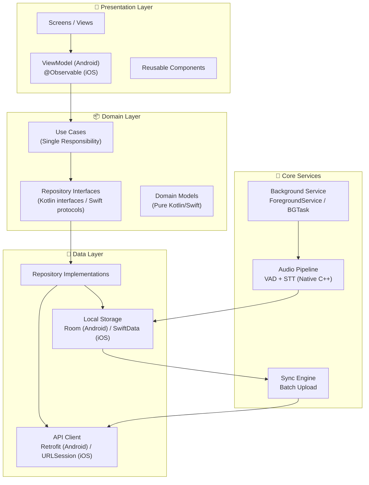

# 📋 Mobile Overview

Edrak's mobile apps are built as **native applications** — **Android** with Kotlin/Jetpack Compose and **iOS** with Swift/SwiftUI — following **Clean Architecture** with strict layer separation.

## Why Native over Cross-Platform?

| Concern | Native Advantage |
|---------|-----------------|
| **Background Audio** | Direct access to `ForegroundService` (Android) and `AVAudioSession` (iOS) — no bridging overhead |
| **Battery Optimization** | Native VAD (C++ via JNI/NDK on Android, C interop on iOS) with zero abstraction tax |
| **Low-Level STT** | Direct JNI bindings (Android) and C++ interop (iOS) for Vosk/Whisper.cpp |
| **OS Integration** | Native notifications, scheduling, permissions — no MethodChannel serialization |
| **Performance** | No Dart VM overhead for always-on audio processing pipeline |

## Architecture Principles

| Principle | Android | iOS |
|-----------|---------|-----|
| **Separation of Concerns** | Data / Domain / Presentation layers | Data / Domain / Presentation layers |
| **Dependency Inversion** | Hilt `@Binds` for repository interfaces | Protocol-based DI via `DIContainer` |
| **State Management** | `ViewModel` + `StateFlow` (MVI) | `@Observable` + `ViewState` enum (MVVM-C) |
| **Async** | Coroutines + Flow | Swift Concurrency (async/await) |
| **Error Handling** | `Result<T>` (kotlin.Result) | `Result<T, Error>` / throwing functions |
| **Navigation** | Compose Navigation + type-safe routes | Coordinator pattern + `NavigationStack` |

## Layer Overview



## Key Dependencies

=== "Android (Kotlin)"

    | Library | Purpose | Layer |
    |---------|---------|-------|
    | Jetpack Compose | Declarative UI | Presentation |
    | Hilt | Dependency injection | Core |
    | Kotlin Coroutines + Flow | Async + reactive streams | All |
    | Retrofit + OkHttp | HTTP client | Data |
    | Room | Local SQLite database | Data |
    | Compose Navigation | Type-safe routing | Presentation |
    | Material 3 | Design system | Presentation |
    | DataStore | Preferences / token storage | Data |
    | WorkManager | Background scheduling | Core |

=== "iOS (Swift)"

    | Library | Purpose | Layer |
    |---------|---------|-------|
    | SwiftUI | Declarative UI | Presentation |
    | Swift Concurrency | async/await, structured concurrency | All |
    | URLSession | HTTP client | Data |
    | SwiftData | Local persistence | Data |
    | Keychain Services | Secure token storage | Data |
    | NavigationStack + Coordinator | Navigation | Presentation |
    | SF Symbols | Icons | Presentation |
    | BGTaskScheduler | Background scheduling | Core |

## Error Handling

=== "Android"

    ```kotlin
    // Repository returns Result<T>
    interface MemoryRepository {
        suspend fun getInsights(date: String, category: String?): Result<List<Insight>>
    }

    // ViewModel handles Result
    viewModelScope.launch {
        getInsightsUseCase(date)
            .onSuccess { insights -> _uiState.update { it.copy(status = Status.Loaded, insights = insights) } }
            .onFailure { error -> _uiState.update { it.copy(status = Status.Error, message = error.message) } }
    }
    ```

=== "iOS"

    ```swift
    // Repository uses async throws
    protocol MemoryRepositoryProtocol {
        func getInsights(date: String, category: String?) async throws -> [Insight]
    }

    // ViewModel handles errors
    func loadInsights(date: String) async {
        state = .loading
        do {
            items = try await getInsightsUseCase.execute(date: date)
            state = .loaded
        } catch {
            errorMessage = error.localizedDescription
            state = .error
        }
    }
    ```
