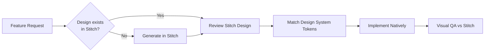

# 🖼️ UI Design Reference (Stitch)

Edrak's UI designs are managed in **Google Stitch** — an AI-powered design tool that generates production-ready UI mockups for mobile and web.

!!! important "Single Source of Truth"
    The Stitch project is the **authoritative design reference** for all screens, components, and flows in the Edrak app. Before implementing any UI feature, you **must** consult the Stitch designs first.

## Stitch Project

🔗 **Project URL:** [Edrak Stitch Project](https://stitch.withgoogle.com/u/4/projects/7131968687172146967?pli=1)

**Project ID:** `7131968687172146967`

## Accessing Designs

### Via MCP Server (Recommended)

The Stitch MCP server is configured in Antigravity. Use its tools to:

1. **Browse the project** — list all screens and design assets
2. **Inspect specific screens** — get layout, component hierarchy, and styling details
3. **Generate new designs** — create mockups for new features following the Edrak design language
4. **Export assets** — extract icons, images, and component specifications

### Via Web UI

Visit the [Edrak Stitch Project](https://stitch.withgoogle.com/u/4/projects/7131968687172146967?pli=1) directly.

## Design Workflow

### Step-by-Step

1. **Check Stitch first** — Query the Stitch MCP server to see if a design exists for the screen/feature you're building.
2. **Generate if missing** — If no design exists, use Stitch to generate a mockup following the Edrak design language (colors, typography, spacing from the [Design System](design-system.md)).
3. **Map to Design Tokens** — Translate the Stitch visual output to the project's design tokens (`EdrakColors`, typography, `EdrakSpacing`). Never use hardcoded values.
4. **Implement natively** — Build the UI using the design system components for the target platform.
5. **Visual QA** — Compare the implemented screen against the Stitch design. Verify spacing, colors, typography, and responsiveness match.

## Design-to-Code Mapping

=== "Android (Compose)"

    | Stitch Element | Compose Implementation |
    |----------------|----------------------|
    | Background colors | `MaterialTheme.colorScheme.background` / `.surface` |
    | Primary brand color | `EdrakColors.Primary` |
    | Accent / CTA color | `EdrakColors.Accent` |
    | Category indicators | `EdrakColors.forCategory(category)` |
    | Heading text | `MaterialTheme.typography.displayLarge` / `.titleLarge` |
    | Body text | `MaterialTheme.typography.bodyMedium` / `.bodyLarge` |
    | Button labels | `MaterialTheme.typography.labelLarge` |
    | Padding / margins | `EdrakSpacing.xs` through `EdrakSpacing.xxl` |
    | Card radius | `RoundedCornerShape(12.dp)` |
    | Modal radius | `RoundedCornerShape(16.dp)` |
    | Chip radius | `RoundedCornerShape(8.dp)` |

=== "iOS (SwiftUI)"

    | Stitch Element | SwiftUI Implementation |
    |----------------|----------------------|
    | Background colors | `EdrakColors.background` / `.surface` (context-aware) |
    | Primary brand color | `EdrakColors.primary` |
    | Accent / CTA color | `EdrakColors.accent` |
    | Category indicators | `EdrakColors.forCategory(category)` |
    | Heading text | `.font(.edrakDisplayLarge)` / `.edrakTitleLarge` |
    | Body text | `.font(.edrakBodyMedium)` / `.edrakBodyLarge` |
    | Button labels | `.font(.edrakLabelLarge)` |
    | Padding / margins | `EdrakSpacing.xs` through `EdrakSpacing.xxl` |
    | Card radius | `.clipShape(RoundedRectangle(cornerRadius: 12))` |
    | Modal radius | `.clipShape(RoundedRectangle(cornerRadius: 16))` |
    | Chip radius | `.clipShape(RoundedRectangle(cornerRadius: 8))` |

## Rules for AI Agents

!!! warning "Mandatory Design Check"
    When implementing **any** UI screen or component for Edrak:

    1. **Query Stitch** via the MCP server to retrieve the design for that screen.
    2. **Follow the design exactly** — layout, hierarchy, spacing, and visual weight.
    3. **Use Design System tokens only** — never introduce raw colors, font sizes, or spacing values.
    4. **Report discrepancies** — if the Stitch design conflicts with the Design System tokens, flag it for review before proceeding.

## Screen Inventory

The following screens should be available in the Stitch project:

| Screen | Feature | Status |
|--------|---------|--------|
| Login / Register | Authentication | 🎨 Design |
| Home Dashboard | Insights Dashboard | 🎨 Design |
| Memory Detail | Memory Ingestion | 🎨 Design |
| Chat Interface | Chat with Memory | 🎨 Design |
| Daily Digest | Daily Digest | 🎨 Design |
| Settings | Smart Controls | 🎨 Design |
| Recording Overlay | Background Service | 🎨 Design |

!!! tip "Keeping Designs in Sync"
    After implementing a new screen, update this inventory with the implementation status. After making design changes in Stitch, re-verify the native implementation matches.
