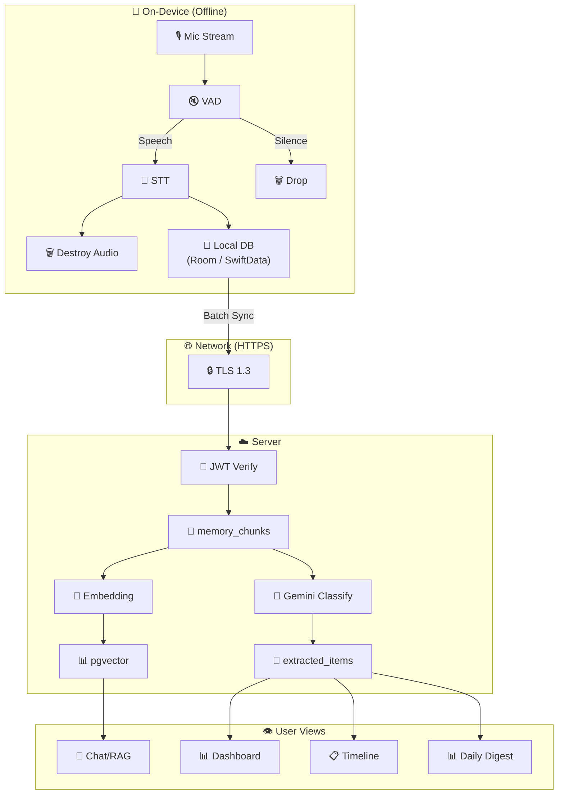

# 🔄 Data Flow

Complete data flow from microphone to user-facing insights.

## What Gets Transmitted

| From → To | Data | Encrypted | Size |
|-----------|------|-----------|------|
| Device → Server | Transcribed text (JSON) | ✅ HTTPS/TLS | ~2-10 KB per batch |
| Server → Gemini | Text + prompt | ✅ HTTPS/TLS | ~5-15 KB |
| Gemini → Server | JSON classification | ✅ HTTPS/TLS | ~1-3 KB |
| Server → Device | Insights, digests | ✅ HTTPS/TLS | ~5-20 KB |
| Server → Device | FCM push | ✅ FCM encryption | ~0.5 KB |

## What NEVER Gets Transmitted

| Data | Reason |
|------|--------|
| Raw audio | Processed on-device, destroyed after STT |
| Audio files | Never created — audio stays in RAM buffers |
| User location | Not collected |
| Contacts | Not accessed |
| Device identifiers | Only FCM token (for push) |
