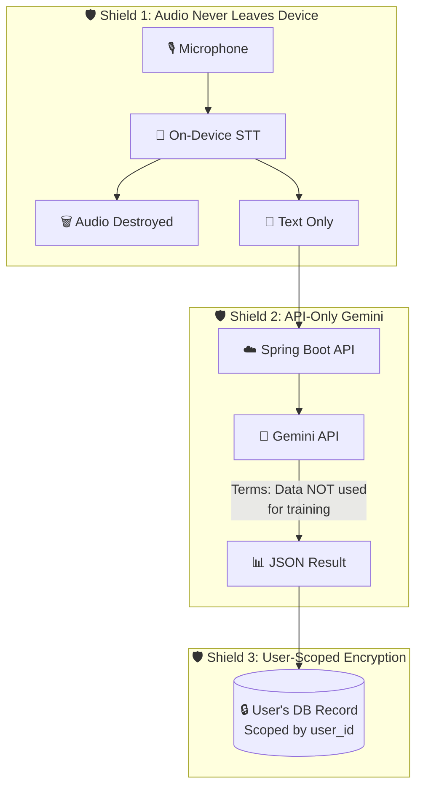

# 🛡️ Privacy Architecture

Edrak is built with a **privacy-first** design. User audio never leaves the device, and cloud AI only processes anonymized text.

## The Three Shields

### Shield 1: Audio Never Leaves the Device

- Speech-to-Text (STT) runs **entirely offline** using Vosk/Whisper.cpp
- Audio exists only as `Float32List` in RAM — never written to disk
- Audio buffers are destroyed immediately after transcription
- Only the resulting **text string** is synced to the backend

### Shield 2: API-Only Gemini (No Training)

- Gemini is accessed via the **Google Cloud API** (not the consumer app)
- Google's [API ToS](https://ai.google.dev/gemini-api/terms) contractually guarantees:
    - Data sent via API is **NOT used to train models**
    - Data is processed in-transit and **not stored** on Google's servers
- The API key lives on the backend server, never in the mobile app binary

### Shield 3: User-Scoped Encrypted Storage

- Every database query includes `WHERE user_id = ?`
- Users can only access their own data
- Even the app developer cannot read individual user records
- JWT authentication ensures request-level identity verification

## Data Classification

| Data Type | Where It Lives | Who Can Access |
|-----------|---------------|----------------|
| Raw audio | Device RAM (temporary) | No one (destroyed immediately) |
| Transcribed text | Device (Isar) → Server (PostgreSQL) | User only |
| AI classifications | Server (PostgreSQL) | User only |
| Daily digests | Server (PostgreSQL) | User only |
| JWT tokens | Device (secure storage) | User only |
| Gemini API key | Server environment variable | Backend only |

## Permissions Required

| Permission | Platform | Reason |
|-----------|----------|--------|
| `RECORD_AUDIO` | Both | Microphone access for listening |
| `FOREGROUND_SERVICE_MICROPHONE` | Android | Keep mic alive in background |
| `POST_NOTIFICATIONS` | Android 13+ | Show persistent notification |
| `Background Audio` | iOS | Keep app alive in background |

!!! warning "User Consent"
    The app **must** obtain explicit user consent before activating the microphone. The user controls:

    - When to start/stop listening (notification buttons)
    - What schedule to use (settings)
    - Whether to enable the feature at all (first-time setup)
